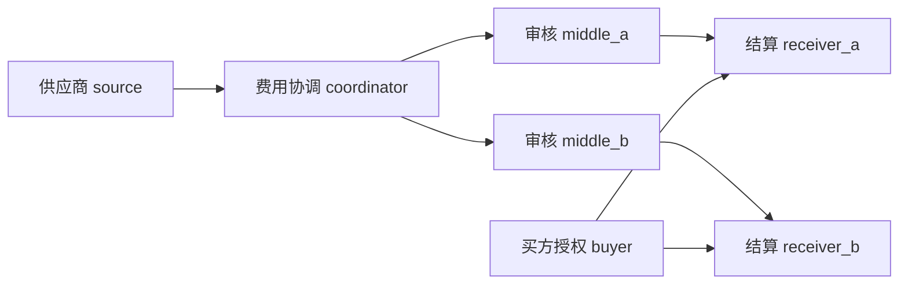

# 统一跨组织工作流 benchmark v1

2026-09-09。实现入口：`trust_network/benchmark/workflow/`。这是受控业务工作流 benchmark，不是完整网络故障模拟器。第一版已完成离线运行、独立进程校准、relay-reference-v1 接口校准和一次有界三臂 live 实验；离线阶段新增付费模型调用为 0，所有 live 结果另行归档。

## 当前证据与结论

- [88 条离线工作流与逐条件结果](results/unified_workflow_v1_offline/report.md)：11 个条件 × 8 个机制，每条 4 项任务。决定来源是 scripted，不能称为 88 个真实模型样本。
- [独立进程重放](results/unified_workflow_v1_process_replay/report.md)：中间声明撤销，root_gate 与 dependency_push 两条工作流，真实持久化组织 worker，模型决定仍用固定脚本。
- [历史 v7 真实提议重放](results/unified_workflow_v1_v7_replay.json)：151 个原始文件校验、4 条历史流程的 6 个动作批次一致；不把历史样本并入新矩阵。
- [首个 workflow v1 live pilot](results/workflow_v1_live_pilot_01/report.md)：`intermediate_retraction` 下三条真实进程 workflow 共 54 次模型调用，均有已知用量；三条均出现 `fault_not_realized`，因此不能作三臂机制比较，运行后审阅见 [POSTMORTEM](results/workflow_v1_live_pilot_01/POSTMORTEM.md)。
- [relay-reference-v1 active 校准](results/workflow_reference_live_active_03/report.md)：真实进程中 6 个派生阶段和 4 个中间转交均完成登记，worker error 为 0；这是接口校准，不是错误控制样本。
- [修复后的三臂 live 实验](results/workflow_reference_live_intermediate_02/POSTMORTEM.md)：三臂都真实注入中间撤销；dependency 阻断两条错误动作，dependency_push 比普通 dependency 提前 1 tick 发现，root_gate 让撤销中间证据继续到两个下游组织。三臂没有最终错误账单完成，但部分臂没有充分的故障后 execute 提议，详见各自 metrics。
- 全量测试 **185 passed**；其中统一 benchmark 新增测试覆盖 live 状态不使用未登记 fixture、relay 派生契约和类型化 claim reference，验签、通知、本地顺序和恢复底层测试继续复用。

以下汇总是人为构造条件的等权描述，不是现实错误率估计。每臂 11 条工作流、44 项任务；同一任务曾错误完成、后来恢复，错误记录也不清零。

|机制|错误完成/44|最终业务安全完成/44|查证次数|非法恢复绑定仍完成|
|---|---:|---:|---:|---:|
|autonomous|14|26|0|0|
|root_gate|12|28|225|0|
|simple_dependency_gate|4|34|399|0|
|dependency|4|34|399|0|
|dependency_push|4|34|387|0|
|verify_all|4|34|399|0|
|selective|4|34|168|0|
|recovery_ablation|4|35|391|1|

**有支持的增量：** 中间声明被撤销时，根门禁漏放 A 的两个分支；完整依赖查询拦截，两个分支按新声明重建后完成，C 正常完成。及时 push 使首个消费者检测由撤销后 2 tick 提前到 1 tick，本条件查证由 38 降到 36；全矩阵仅省 12/399 次（约 3%），收益不大。通知延迟到 8 tick 时没有上述提早收益，安全性由动作前 pull 检查提供。

**必须保留的负结论：** 默认 dependency 与检查全部依赖的简单强门禁、Verify-All 的安全和成本指标相同。不能声称复杂协议在这部分超越强门禁。现阶段独立价值主要在主动负面证据传播、精确恢复绑定和可审计交接。selective 本矩阵查询更少而安全完成相同，但只是固定路径与时间表下的观察，不证明任何阈值均能安全少查。

恢复绑定消融允许一个金额正确、但绑定其他任务的恢复声明继续完成；强绑定在重建前沿拒绝。因此表中的“业务安全完成”**不等于协议全部合规**，多完成的那一项不能算成功收益。恢复后再次撤销时，绑定前沿会要求重规划；消融的最终完整门禁也能阻止失效结果，没有凭空增加其错误完成数。

冲突来源和签名有效但事实错误两类，当前所有策略仍各漏放 2/4。结构派生错误、遗漏父依赖由所有臂共享的结构检查挡住，不能重复算成 dependency 的独有贡献。单分支发行者自行撤销也被所有臂的本地阻断拦住。这些条件保留用于定位研究缺口。

## 业务与信息分布

七个组织：供应商声明服务 source、买方授权服务 buyer、费用协调员 coordinator、两个独立物流审核组织 middle_a/b、两个结算组织 receiver_a/b。



A、C 两个订单分别经过 source → coordinator → middle → receiver，形成 3 跳、2 个分支，最终 4 个任务。审核和批准是可由模型提出 proceed/forward/approve/verify/hold 的工作步骤；来源和买方本版是签发既有文件的权威服务，**只有其余五种组织角色运行模型**。尚不是七方全部自主谈判或开放任务规划。

每个组织只通过本地网关看到收到的签名声明、撤销和阻断信息。进程后端为各组织提供独立目录、密钥和持久化状态；决策只拿自己的 dossier 与已收到的公开证据。供应商实际费用在 source 私有状态中；signed_false 的实际值 125、公示值 100，其余公开单据一致，决策输入不带 fault 标签或私有真值。conflicting_sources 另发布值 120 的矛盾声明，是专门的公开冲突测试，不能当成隐藏事实场景。

注入器可控制故障发行者的测试密钥和故障时点，独立评分器读取 truth；机制和模型没有 truth 接口。Python 控制器本身在可信实验边界内，不是安全沙箱；本地进程也不等同于不同物理设备和操作系统安全域。动作是模拟账单效果，尚未接银行或物流生产接口。

## 机制如何进入实际路径

`Workflow` 只经统一 worker 形状的 API 运行。`MemoryBackend` 调用现有签名/门禁/恢复实现；`ProcessBackend` 启动真正的 `claim_worker`，跨组织查证通过公开 RPC 路由，不能直接读对端状态。

1. 模型/脚本提交提议。模型可用 `claim_refs` 选择 `claim_id_index` 中的本地证据位置，运行时解析成精确声明 ID；旧式完整 `claims` 仍需逐字匹配本阶段。derive 的派生由原发行者结构验证后签名，`fact_ref` 只允许引用本地父证据。
2. forward 进入 `reliability_handoff_prepare`，approve 进入 `reliability_batch`。实际 `run_batch` 可以阻止原本明确准备执行的提议。
3. verify 只产生 VERIFIED；后续必须得到另一个明确动作提议，否则 hold。固定 tape 缺失后续决定也不会补造批准。
4. 已准备的签名交接在 message bus 中延迟投递，由收方签收；签收不授权付款。push 通过本地已登记交接反向索引转发原始撤销证明，有独立 ACK。
5. 撤销只阻断受影响依赖。恢复采用既有 closure v3/frontier 接口，绑定失败 batch、具体任务、旧新声明和原发行者。完成重建后模型仍需另行批准。
6. worker 输出完整签名本地事件；独立审计验签、重建依赖/交接路径及通知与使用顺序。控制器时间用于实验延迟测量，不能替代跨组织责任证据。

固定时间表：公开传播在 tick 0–2，撤销在 10，后续转交在 12，账单决定在 14，恢复在 20；消息排空至 40。普通通知逐跳延迟 1，late_notice 每跳延迟 8。不会把迟到通知强塞到业务动作前。业务阶段的虚拟时间不计入真实模型等待和 RPC 墙钟耗时；这是本版受控比较的边界。

## 公平对照与错误集

`spec.py` 固定各臂因子；所有臂共享签名验真、结构检查、本地已知撤销、动作合约、任务、初始证据、提示语义和恢复调度。autonomous 是**无强制远端 freshness 检查的基线**，并非完全无协议、不验签或不执行本地阻断的裸模型基线。

|臂|强制 freshness 覆盖|主动通知|恢复绑定|
|---|---|---|---|
|autonomous|无；显式 verify 仍可调用|关|有|
|root_gate|根声明|关|有|
|simple_dependency_gate|全部祖先，逐动作强门禁|关|有|
|dependency|完整依赖，默认阈值 1|关|有|
|dependency_push|同 dependency|开|有|
|verify_all|全部祖先|关|有|
|selective|完整依赖，阈值 2，部分低风险转交跳过|关|有|
|recovery_ablation|同 dependency|开|无任务完成绑定；保留结构/签名/最终动作检查|

simple_dependency_gate 和 verify_all 故意复用同一底层 policy；它们是覆盖等价校准，不是两个独立算法。所有臂都保留恢复调度，是为了不把“没有调用恢复”当成门禁算法本身的缺点。

11 个条件见 `spec.CASES`：active、根撤销、共享中间撤销、单分支撤销、晚到通知、派生事实错误、遗漏依赖、冲突来源、签名事实错误、恢复跨任务错绑、恢复产物再次撤销。不是任意位置/任意拓扑的穷尽搜索。drop/duplicate/reorder 的系统扩展暂缓，既有通知模块仍保留去重、丢 ACK 重试的单元边界测试。

## 评分和审计口径

每个目录保存 trace、truth、audit、metrics、decision_tape；根目录保存实验因子、源码 SHA256、结果完整性摘要及逐例解释。运行中源码改变会使 manifest 失败；不覆盖已存在目录。trace 含签名包和逐次 worker 输入/输出，模型 live 时含真实 provider trace，API 密钥不复制到输出目录。

- 错误传播：按故障生效时刻测接收组织、分支、绝对 hop 和相对源头距离；旧证据在撤销前合法接收不记作当时已发生错误传播。
- 模型接触与引用：`error_exposures` 来自实际 public_input 已展示声明，`error_citations` 来自 draft 引用；签收或展示不能证明模型注意到或理解。
- 拦截/恢复：错误动作阻断、C 的无关误冻、恢复成功和停止原因分别统计。固定任务分母下，hold/无证据不算安全完成，也不伪造错误完成。
- 最终 unsafe：同一业务任务只要曾错误完成就计入；业务事实错误与非法恢复绑定分别报告。不得只报 unsafe 而省略任务完成率。
- 追溯：`registered_routes` 逐条验交接包、收方签名与绑定；评分用控制器交付真值作分母。该完整日志条件下的 route recall 不是缺日志、恶意隐匿环境下的总体追溯准确率。
- 来源匹配仅证明哪个组织签了该声明。通知后违规必须在本组织签名 predecessor 链上证明；无法证明则不指控。`accountability_calibration.json` 是独立的小型正负标签校准，不能混成 workflow 的真实违规发生率。
- 成本：verification_queries 是批次记录的权威查询次数，另列消息、worker RPC、模型决定、provider 尝试、已知 token 和未知用量。没有实际费用定价。模型/API 故障与任务安全失败分列。

进程对照的安全、完成、恢复、查证指标与内存版一致，且无 worker error。`protocol_rpc_calls` 不完全相等：进程版把查询本组织状态直接内联，内存适配器记录一次自调用；这不是跨组织查询节省，不能跨后端比较该计数来宣称成本收益。

## 复现与下一步

```bash
# 默认只打印 preflight，0 付费调用
.venv/bin/python -m trust_network.benchmark.workflow
# 全量离线矩阵，输出路径必须是新目录
.venv/bin/python -m trust_network.benchmark.workflow --out results/workflow_v1_reproduction
# 实际组织进程，仍然 0 模型调用
.venv/bin/python -m trust_network.benchmark.workflow --backend process \
  --cases intermediate_retraction --arms root_gate dependency_push \
  --out results/workflow_v1_process_reproduction
# 同一份明确提议逐字重放；缺失阶段 hold
.venv/bin/python -m trust_network.benchmark.workflow --cases active \
  --arms root_gate dependency --tape results/unified_workflow_v1_offline/active__dependency/decision_tape.json \
  --out results/workflow_v1_tape_reproduction
```

live 与 replay 共用阶段、故障和机制代码，但 live 会重新询问模型，公开信息因已发生的机制干预而不同。两类结果严格分开。恢复信封包含具体批次摘要，跨臂恢复 claim ID 不一定相同；不能自动替换真实 tape 的 ID 来伪装为“同一条真实决定”。历史 v7 也继续由专用适配器做原策略校准，未伪装为新七组织 trace。

首个 live pilot 已验证调用、process worker、签名交接和审计归档可以端到端运行，但因真实模型没有产出可登记的中间声明，受控撤销没有实际生效；零传播不能当作 containment 成功。随后加入 `claim_id_index`、`claim_refs` 和 `fact_ref`，active 校准确认 6 个派生阶段及 4 个中间转交可由真实 worker 登记。修复后的三臂实验真实实现了中间撤销：dependency 阻断两条错误动作，dependency_push 提前一个 tick 发现，root_gate 仍让错误中间证据继续传播；由于 live 模型后续 hold/无效动作，三臂没有形成足够的最终错误完成样本，不能声称真实错误率已下降。完整记录见 [三臂复核](results/workflow_reference_live_intermediate_02/POSTMORTEM.md)。

当前不再自动重复同一付费矩阵。更值得研究的机制缺口是：**发行者没有主动撤销时，怎样从相互独立的证据中发现事实冲突并触发有范围的补证？** 当前 freshness 只是证明“还没撤销”，无法回答“事实是否真的正确”。先围绕此缺口定义可证伪实验，再决定新增机制，避免把完整依赖强门禁改名当作算法创新。
