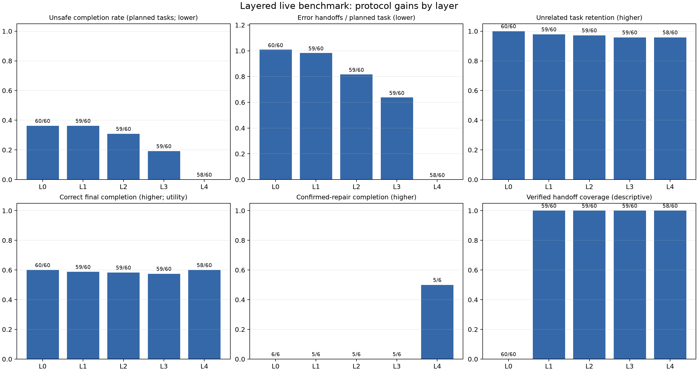

# 最终统一 layered live：合约修复、网络重试与协议收益

本报告合并同一份 350 项 immutable plan 的四个结果来源；不复制或修改任何 worker 私有账本。
状态：completed=344，unknown=6；来源={'base_preserved': 60, 'claimref_fix': 233, 'provider_retry': 46, 'contract_cleanup': 5, 'base_interrupted': 6}。
旧批次发现 23 条含 initial invalid_claim_refs 的 workflow，全部由 claimref_fix、provider_retry 或 contract_cleanup overlay 替换；网络重跑覆盖 46 条，动作/引用契约清理覆盖 5 条 workflow。
六条在合约审计暂停时已经发出调用但没有最终 result 的 workflow 保持 unknown，不当作安全完成，也没有自动付费重发。

## 机制与网络异常

provider failure 的根因是 provider 适配器在第一次网络/5xx/截断响应后直接 fallback hold，没有使用已有的第二次尝试预算。修复后仅对这些瞬时传输/服务故障重试一次；模型输出格式、错误 claim_refs、预算耗尽仍不重试。
claim-ref 修复后、网络 overlay 之前的逻辑选择中，54 个 provider failure decision 分布在 46 条 workflow；网络 overlay 的 46 条 workflow 全部完成。重试后最终 provider_failure decision=0，worker_error=0。journal 仍记录了随后成功的底层失败 attempt，不能把它抹掉。
完整异常审计中，4 条非法动作和 1 条空 claim_refs 曾被模型返回；补充契约后这 5 条 workflow 均已重跑，最终选择集的 model invalid、invalid outcome 和 worker error 均为 0。4 个 budget decision 是预算耗尽的保守停机，单独计入可用性，不归为机制错误。tampered_handoff 的 58 次签名拒绝是预期安全门禁。

## 主矩阵固定分母结果

以下正确完成率、无关保留率和错误率以计划任务为分母；unknown workflow 的任务留在分母中。known-only 率同时保存于 aggregate.csv 和 summary_by_layer.csv。错误传播交接是实际 post-fault cached-claim handoff，active 场景没有错误时为零。

|层|完成/计划|错误完成/计划任务|正确完成/计划任务|无关保留/计划无关|传播交接|确认修订恢复|模型hold|provider失败决定|
|---|---:|---:|---:|---:|---:|---:|---:|---:|
|L0|60/60|87/240 (36.2%)|144/240 (60.0%)|144/144 (100.0%)|242|0/12 (0.0%)|52|0|
|L1|59/60|87/240 (36.2%)|141/240 (58.8%)|141/144 (97.9%)|236|0/12 (0.0%)|41|0|
|L2|59/60|74/240 (30.8%)|140/240 (58.3%)|140/144 (97.2%)|196|0/12 (0.0%)|49|0|
|L3|59/60|46/240 (19.2%)|138/240 (57.5%)|138/144 (95.8%)|153|0/12 (0.0%)|78|0|
|L4|58/60|0/240 (0.0%)|144/240 (60.0%)|138/144 (95.8%)|0|6/12 (50.0%)|99|0|

全计划任务：错误完成 312/1400，正确完成 806/1400，无关任务保留 798/840。正确完成率是业务可用性指标；hold 或 block 是安全处理，却不会被计为完成。

## 结果解读

正向收益来自完整依赖检查、定向通知和绑定恢复：它们把错误候选限制在受影响依赖闭包内，并在确认修订后允许后代重建；无关分支仍有机会继续。分层 live 数据中，错误完成率从 L0 的 36.2% 降到 L3 的 19.2%，L4 为 0.0%；L4 的恢复和通知指标仍应与 L4_no_recovery、L4_no_push、L4_no_fact 对照阅读。
正确完成率不随安全拦截同步上升：L4 把低层可能错误完成的任务转为 block/hold，其中只有满足修订条件的任务才能恢复为正确完成。在 L4 的 confirmed_repair 场景，10 个任务提出并提交了 request_recovery，6 个完成恢复；另外 4 个在重建阶段因本轮 workflow 预算耗尽而停止，未被协议拒绝。其余故障没有权威确认的新来源，因此保持暂停是预期安全行为。
事实层边界仍然清楚：签名有效且尚未被撤销的错误事实不能仅靠来源链发现。因此 signed_false 情景的安全收益不能写成事实真实性保证。
追溯图来自同一批 L4 执行的证据投影，展示签名交接、签收和普通日志之间的信息差异；它没有独立法律责任标签，因此不报告责任准确率或误指控率。

## 消融与成本

消融只在匹配的 long_chain_fork/business-0 的 10 个 fixture 上比较；confirmed_repair 的一个消融 workflow 是 unknown，报告中的有效配对数会明确体现这一点。L4 主层的 confirmed_repair 恢复率单独以该场景的受影响任务作分母。
模型成本用 provider 返回的 known tokens 和 provider attempts 表示；失败 attempt 的 usage unknown 单独计数。业务图由脚本生成，效果是模拟的，同机 process worker 和同步 authority 查询不代表真实跨组织部署 SLA。

## 产物

- `aggregate.csv/json`：350 个 plan entry 的来源、状态、固定分母和逐 workflow 指标。
- `task_metrics.csv/json`：逐任务结果，unknown 任务保留。
- `summary_by_layer.csv`、`summary_confirmed_repair_by_layer.csv`、`summary_by_case.csv`、`summary_by_topology.csv`、`summary_by_business.csv`：拆分统计。
- `paired_differences.csv/json`、`cluster_intervals.csv/json`：按 fixture 配对的增量和描述性 bootstrap 区间。
- `traceability.csv/json`、`traceability_sources.json`：同一 L4 执行的证据投影；不是跨层责任准确率。
- `mechanism_network_audit.json`：初始异常、分类、修复 overlay、重跑覆盖和最终异常计数。
- `protocol_gains_by_layer.png/pdf`、`protocol_delta_vs_L0.png/pdf`、`ablation_gains.png/pdf`、`protocol_cost.png/pdf`、`traceability_projection.png/pdf`：收益、增量、消融、成本和追溯图；正确完成率表示业务可用性，错误完成率和错误交接表示安全收益。

